# Hamiltonian

**Run any agent. Trust none. Keep evidence when it matters.**

Hamiltonian is a local-first operator cockpit for agent work. Describe the
result you want, run a bounded local check, optionally compare a second agent,
hand the resulting goal to the correct Codex project, and bring the completion
receipt back for independent review.

> **Public alpha and licence:** Hamiltonian is public source-available software,
> not open-source software. Personal, educational, research, hobby, and other
> non-commercial use is permitted under the
> [PolyForm Noncommercial License 1.0.0](LICENSE). Paid products, hosted or
> managed services, enterprise tools, and commercial AI systems require a
> separate written licence from TWO HANDS NETWORK LTD. See [NOTICE.md](NOTICE.md).

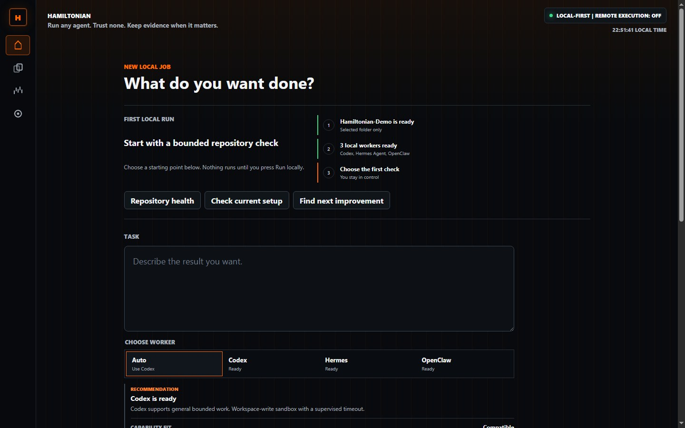

The normal path stays deliberately simple:

1. Write the job in plain language.
2. Press the lane-aware **Run** action.
3. Turn a useful result into a Maintenance or Expansion goal.
4. Let Hamiltonian detect the return receipt and review the completed work.

All application state stays in the selected repository or operator-selected
local data directory. The cockpit binds only to `127.0.0.1`, remote command
execution is off, and evidence remains optional unless the operator selects it.

## How It Works

### 1. Run a bounded local check

Hamiltonian saves a task packet, evaluates its local safety, memory, and cost
gates, then launches the selected callable agent lane only after the operator
presses the main Run action.

Before launch, a versioned capability manifest classifies the task and explains
whether each worker is a strong fit, compatible, or unsupported. The expanded
view shows declared strengths, safety controls, and limitations without
confusing CLI availability with task suitability.

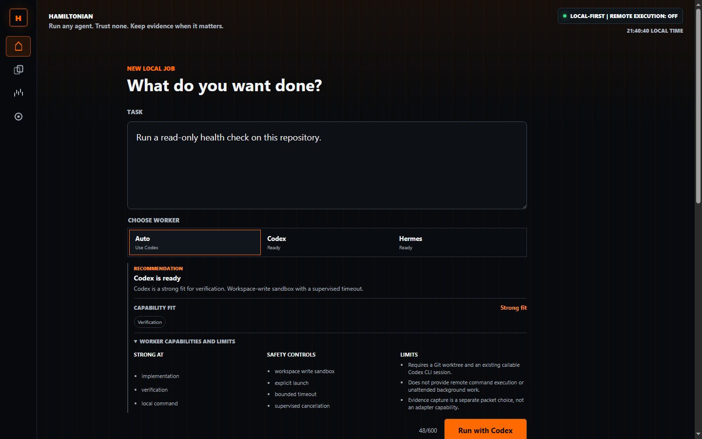

Unsupported requirements stop before packet creation or process launch. Every
current manifest refuses remote command execution, gateways, SSH, and delivery
services.

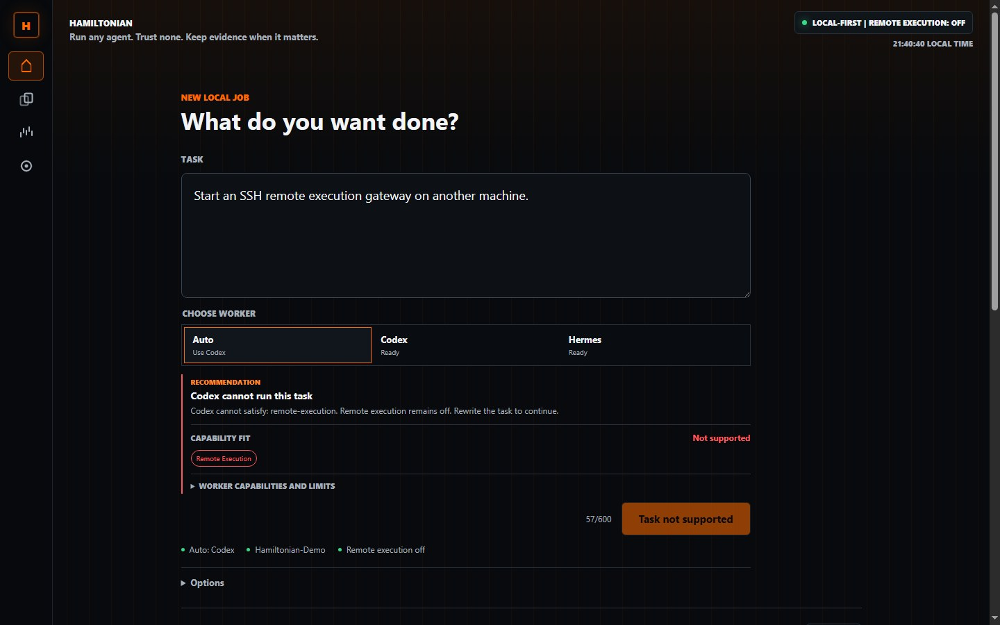

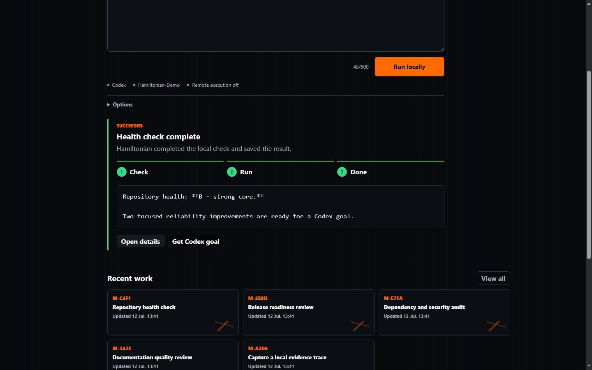

### 2. Compare a second agent when the decision matters

**Compare agents** opens a preview without launching anything. One explicit
button starts the counterpart on the exact same task, then Hamiltonian shows
both final answers with standardized receipt fingerprints. The saved comparison
contains receipt metadata, not duplicated answer text.

Comparison history can reopen the original answers after verifying their packet
boundary and receipt fingerprints. The operator can select Codex, Hermes, or
Neither, record a short reason, export a sanitized comparison receipt, and
create a Codex goal directly from the chosen result without another model run.

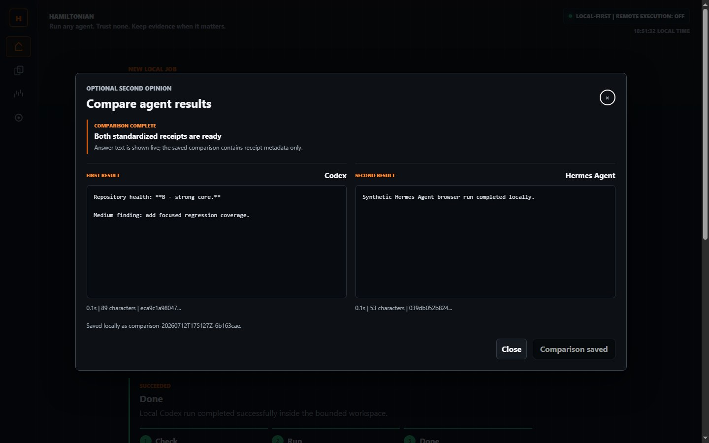

### 3. Hand production work to the correct Codex project

**Get Codex goal** creates one bounded handoff with a workspace lock, baseline
commit, acceptance criteria, verification requirements, and a local return
receipt path.

| Goal | Use it for |
| --- | --- |
| **Maintenance** | Resolve confirmed findings and raise the current health result one defensible step. |
| **Expansion** | Add or extend one clearly bounded capability while preserving the current baseline. |

Hamiltonian copies the goal and can open the repository in Codex, but the user
still chooses the destination project task. It never injects work into another
task automatically.

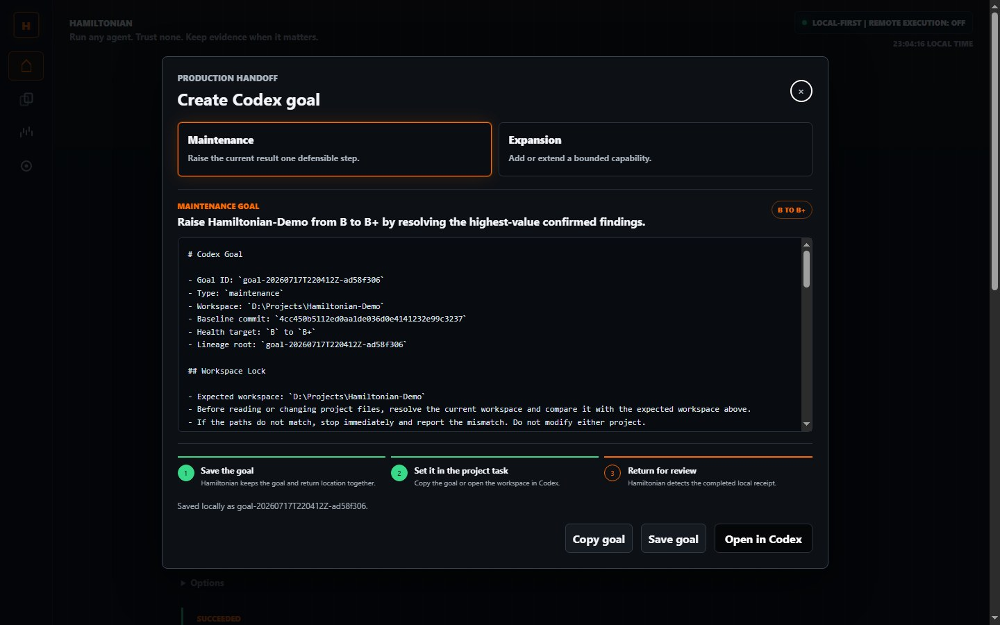

### 4. Review the return receipt

When Codex writes `return.json`, the Review inbox notices it automatically and
shows **Review now** above ordinary history. Hamiltonian then runs a local,
read-only check against the saved baseline and acceptance criteria.

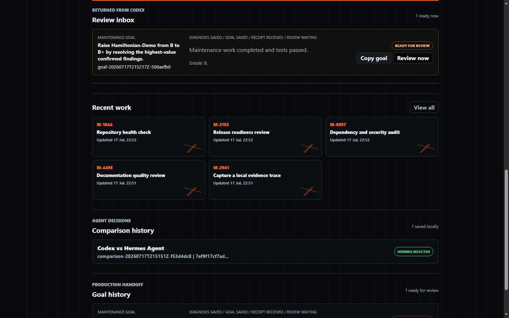

### 5. Correct incomplete work without losing the thread

An incomplete review produces a focused corrective goal. Parent, lineage root,
correction number, receipt, review, and grade movement remain visible in one
history.

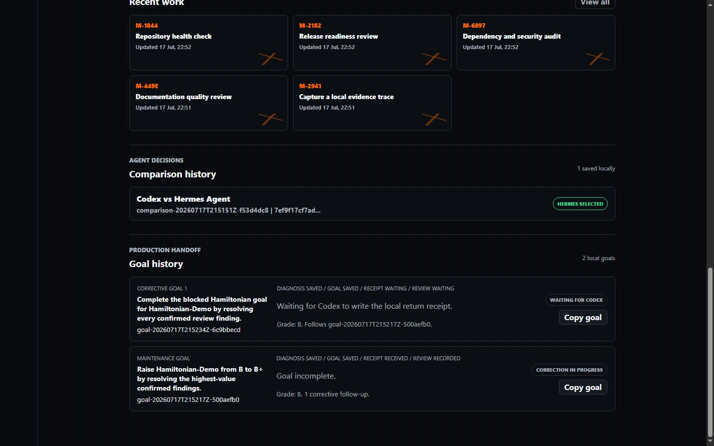

## Desktop Experience

The native Windows shell opens on a workspace launcher, remembers recent local
repositories, and highlights goals that are ready for review. The same core
workflow adapts to a narrow mobile-sized viewport for remote desktop or compact
windows. Empty workspaces offer three bounded first-run checks, while returned
Codex goals appear in a review inbox before ordinary packet and goal history.

<table>
  <tr>
    <td width="66%">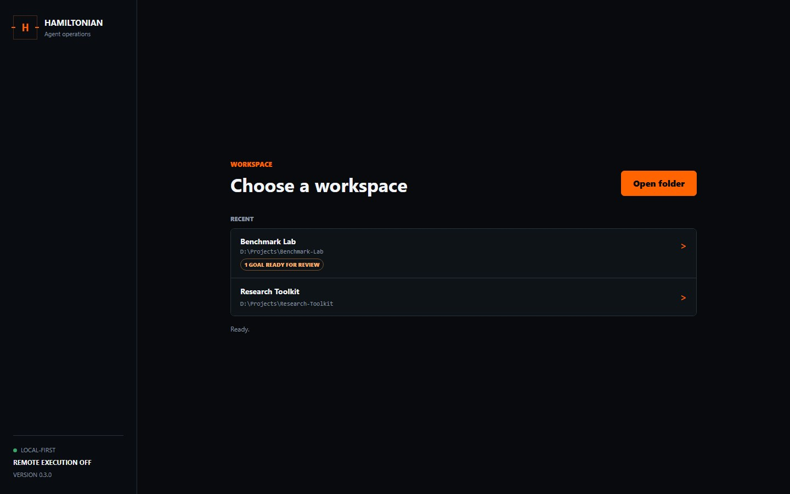</td>
    <td width="34%">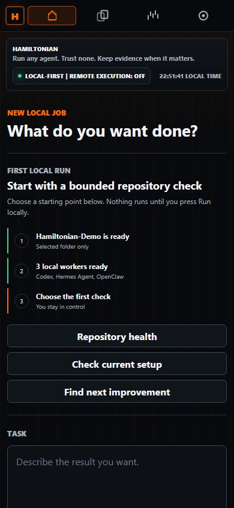</td>
  </tr>
</table>

## Version 0.9.0

- Guided first-run workspace check with repository health, setup verification,
  and bounded-improvement starting points.
- Live local worker readiness before the first launch, with all four worker
  choices presented in one stable desktop row.
- Review inbox that promotes valid Codex return receipts and corrective work
  above ordinary packet and goal history.
- Three-step goal handoff state: save locally, set in the Codex project task,
  and return to Hamiltonian for receipt-backed review.
- Explicit sanitized diagnostics export containing aggregate runtime state but
  no workspace path, task text, adapter output, credentials, or remote upload.
- Browser regression coverage for first-run guidance, goal handoff progress,
  review inbox actions, diagnostics export, and desktop/mobile rendering.

### Included From 0.8.0

- Public source-available governance under the established TWO HANDS NETWORK LTD PolyForm Noncommercial terms.
- Plain-language commercial-use notice and contribution relicensing boundary.
- Security policy, private-first vulnerability reporting, structured issue forms, and pull request safety checklist.
- Generic D-drive-first public paths with portable fallback for systems without a D drive.
- Deterministic .NET ZIP packaging replacing the PowerShell compressor that could stall locally.
- Package metadata linking the canonical repository, issue tracker, and licence.
- Explicit unsigned Windows alpha-package warning and source-first installation guidance.

### Included From 0.7.0

- First callable OpenClaw lane through the official embedded one-shot CLI boundary.
- Forced `--local` transport with post-run verification that the result came from the embedded runtime.
- Per-run OpenClaw configuration that binds the gateway to loopback and denies every tool.
- Task-text-only analysis and handoff work: no repository reads, writes, commands, plugins, MCP tools, channels, or delivery.
- Explicit OpenClaw model configuration and safe unavailable fallback when its CLI contract cannot be probed.
- OpenClaw packet, API, receipt, cancellation, browser, and non-embedded rejection coverage.
- Four-lane Mission Home selector with capability-aware Auto routing and setup guidance.

- Versioned, deterministic capability manifests for Codex, Hermes, Local, and OpenClaw lanes.
- Task requirement classification with `strong`, `compatible`, or `incompatible` adapter fit.
- Capability-aware Auto routing that considers suitability separately from CLI availability.
- Mission Home explanations for task requirements, worker strengths, safety controls, and limitations.
- Hard refusal before packet creation when every callable adapter lacks a required capability.
- Capability manifest schema, version, digest, fit, requirements, and missing capabilities persisted in route and runner-plan records.
- Explicit remote-execution incompatibility across every current local adapter manifest.
- Mission Home comparison history with verified answer rehydration.
- Explicit operator decisions: Codex, Hermes, or Neither, with an optional sanitized reason.
- One-click Codex goal creation from the selected result with comparison and packet lineage.
- Sanitized comparison receipt export containing fingerprints and the decision, never answer text or workspace paths.
- Safe degraded reopen behavior when an original packet, answer, or matching receipt is unavailable.
- Standardized result receipts for every terminal supervised run.
- Explicit Codex/Hermes second-opinion preview with no launch on dialog open.
- Side-by-side final answers, duration, result length, and digest fingerprints.
- Repo-local comparison records that omit answer text and workspace paths.
- Comparison cancellation, unavailable-adapter guidance, and responsive desktop/mobile layouts.
- Mission Home `Auto / Codex / Hermes` worker selector with live local readiness.
- Task-aware Auto routing that chooses only callable Codex or Hermes adapters.
- Plain setup guidance when an adapter is unavailable, without installing tools or handling credentials.
- Lane-aware one-button progress, cancellation, failure, and result states on desktop and mobile.
- First callable non-Codex lane through the official Hermes Agent one-shot CLI.
- Hermes safe mode, checkpoints, bounded turns, explicit launch, timeout, cancellation, and local reports.
- Safe unavailable fallback when Hermes is not installed or its configured command cannot be probed.
- Lane-aware packet controls and a Windows Edge smoke journey covering Codex and Hermes.
- Read-only GitHub Actions checks on Python 3.10 and 3.13.
- Deterministic Windows browser-smoke verification with screenshot artifacts.
- Reproducible Windows portable ZIP, release manifest, and SHA-256 checksum.
- Tag packaging with release publication gated by an explicit manual boolean.
- Native Windows WebView2 desktop shell and D-drive-first storage.
- One-button local Codex workflow with cancellation and bounded runner state.
- Maintenance and Expansion goal handoffs.
- Automatic receipt discovery and local review recording.
- Corrective goals with parent and grade lineage.
- Goal status in Mission Home and the desktop launcher.
- Optional AgentLedger evidence boundary with no remote execution.

## Product Boundary

Hamiltonian is the orchestration and review layer. Its core unit is the task
packet: intent, selected lane, local gate results, execution state, handoff, and
optional evidence references.

AgentLedger remains a separate flight recorder for capturing what happened and
producing evidence bundles. Hamiltonian only represents AgentLedger when the
operator selects evidence or recorder mode.

Codex, OpenClaw, Hermes, and the local runner are adapter lanes. Route advice is
metadata, not execution authority. Prototype adapters stay local, degrade
safely when unavailable, and do not scrape private repositories or enable
remote commands.

The name nods to Margaret Hamilton's correctness-under-pressure flight software
and William Rowan Hamilton's language of state, trajectories, and action.

## Quick Start

```powershell
git clone https://github.com/Martin123132/Hamiltonian.git
cd Hamiltonian
python -m pip install -e .
hamiltonian cockpit --repo .
python .\scripts\run-cockpit.py --repo .
hamiltonian doctor --repo .
hamiltonian run --repo . -- python -c "print('hello Hamiltonian')"
hamiltonian run --repo . --runner agentledger -- python -m pytest
hamiltonian packets --repo . create --task "Draft a local packet" --agent codex
hamiltonian packets --repo . advance <packet-id> --stage gate
hamiltonian packets --repo . list
hamiltonian packets --repo . rebuild-index
hamiltonian packets --repo . detail <packet-id>
hamiltonian packets --repo . export <packet-id>
```

The cockpit starts a local web app at:

```text
http://127.0.0.1:8765
```

### Windows Desktop

Install the optional desktop shell and open Hamiltonian in its own native
WebView2 window:

```powershell
python -m pip install -e ".[desktop]"
hamiltonian desktop --repo D:\Projects\YourProject --data-dir D:\Hamiltonian\Data
```

Omit `--repo` to start on the desktop workspace launcher. It lists up to eight
recent local repositories and provides a native folder picker. Recent paths are
stored only in the selected desktop data directory; missing folders are removed
from the list automatically.

Desktop mode allows one Hamiltonian instance at a time, binds an ephemeral port
on `127.0.0.1`, locks every API request to the repository chosen for that
window, keeps WebView storage in the selected data directory, and stops the
local server when the window closes. Remote execution remains off.

Build a portable Windows application under `D:\Hamiltonian` when a D drive is
available, with a local application-data fallback on systems without one:

```powershell
powershell -ExecutionPolicy Bypass -File .\scripts\build-windows-app.ps1
```

The default executable is written to:

```text
D:\Hamiltonian\Builds\dist\Hamiltonian\Hamiltonian.exe
```

The build also writes:

```text
D:\Hamiltonian\Builds\Hamiltonian.lnk
D:\Hamiltonian\Builds\dist\Hamiltonian\build-info.json
D:\Hamiltonian\Builds\dist\Hamiltonian\SHA256SUMS.txt
D:\Hamiltonian\Builds\Hamiltonian-windows-x64-0.9.0.zip
D:\Hamiltonian\Builds\Hamiltonian-windows-x64-0.9.0.release.json
D:\Hamiltonian\Builds\Hamiltonian-windows-x64-0.9.0.sha256
```

The shortcut opens the workspace launcher and points its application data at
`D:\Hamiltonian\Data`. The build manifest and checksum provide the
versioned verification boundary needed for a future manual updater. No remote
update check or background update service is enabled. The portable ZIP also
contains `LICENSE`, `NOTICE.md`, and this README.

Every pull request now runs the complete test matrix, the real Edge browser
journey, and a Windows desktop package build. Tag pushes build reviewable
workflow artifacts but do not publish them. The separate **Package Release**
workflow only attaches the unsigned ZIP to a GitHub release when it is
started manually with `publish` explicitly enabled.

The Windows alpha package is currently unsigned and may trigger Windows
SmartScreen or antivirus reputation warnings. Verify the published SHA-256 and
release manifest before use. Installing from reviewed source is the primary
trust path until code signing is available.

The packaged app uses a `data` directory beside the executable unless
`HAMILTONIAN_HOME` or `--data-dir` is supplied. It does not use `%APPDATA%` for
its WebView profile. The build also generates and embeds the Hamiltonian app
icon without writing packaging caches to `C:`.

Desktop runtime failures write sanitized local reports under
`<data-dir>\crashes\`. Reports omit absolute paths, secret-like values, file
contents, environment variables, and remote URLs. They are never uploaded.

The Advanced screen can also create an operator-requested diagnostics file
under `<workspace>\.hamiltonian\diagnostics\`. It contains version, aggregate
packet and goal counts, Git state, and boolean adapter availability. It omits
workspace paths, task text, file contents, raw adapter output, environment
variables, and credentials, and it is never uploaded automatically.

The normal cockpit flow is deliberately short:

1. Write the result you want in the large task field on Home.
2. Press **Run locally**.
3. Read the result under **Check**, **Run**, and **Done**.

Hamiltonian chooses the Codex lane, creates the execute packet, runs the local
gates, and launches the bounded runner through that single action. Press the
same button while a job is running to stop it. Evidence, timeout, and the older
manual cockpit are available under **Options**; they are not required for the
normal path. When the Codex CLI cannot be called, Home says so directly and
keeps the checked packet available through **Open details**.

## Codex Goal Handoff

After Hamiltonian completes a check, **Get Codex goal** turns the result into a
bounded production handoff:

1. Choose **Maintenance** to raise the current result one defensible grade step,
   or **Expansion** and state the capability that should become possible.
2. Review, copy, or save the generated goal. **Open in Codex** copies it and
   opens the repository in the Codex desktop app; choose the existing project
   task and paste the goal there.
3. Codex performs the work and writes the requested local completion receipt.
4. Hamiltonian detects the receipt automatically and shows **Review now** in
   Goal history. The review runs locally against the saved baseline and
   acceptance criteria.
5. A complete review closes the goal. An incomplete review offers **Create
   corrective goal**, preserving the parent goal and grade lineage.

Goal packages remain local under:

```text
.hamiltonian/goals/<goal-id>/
  goal.md
  goal.json
  source-report.md
  return.json
  review-report.md
  review.json
```

Hamiltonian adds `.hamiltonian/` to the repository's local Git exclude file;
it does not modify tracked ignore rules. The handoff never pushes, publishes,
injects work into an existing Codex task, or enables remote execution. The user
chooses the destination project task explicitly.

Every generated goal contains a workspace lock. Codex must resolve its current
workspace and stop without changing files when it does not exactly match the
absolute path recorded by Hamiltonian.

## Task Packets

The cockpit now persists local task packets under:

```text
.hamiltonian/tasks/<packet-id>/
  task-packet.json
  task-packet.md
  runner/
    runner-plan.json
    latest-run.json
    runs/<run-id>/
      state.json
      events.jsonl
      runner-output.log
      last-message.txt
      runner-report.json
      result-receipt.json
  evidence/
    agentledger-placeholder.json
  history.json
.hamiltonian/tasks/index.json
.hamiltonian/comparisons/<comparison-id>/comparison.json
.hamiltonian/comparisons/<comparison-id>/comparison-export.md
```

Each packet includes an explicit lane assignment and gate-run summary. The lane
records which adapter was selected and confirms that remote execution stayed off
in the prototype. The route decision records the recommended lane, the selected
lane, confidence, reasons, warnings, and the local-only routing policy. The gate
run records counts, blocked gates, simulated gates, and the next operator
action. Execute-stage packets also include an execution boundary that can be
awaiting approval or blocked while keeping local and remote execution off.
Clear execute packets now persist a sanitized runner plan behind a shared
`prepare`, `launch`, `stream`, `cancel`, `finish`, and `report` adapter contract.
The Codex lane can launch `codex exec` only after an explicit operator action,
inside the selected Git workspace, with `workspace-write`, approvals disabled
for the child process, an operator-selected timeout, and remote command
execution off. Hamiltonian supervises the local process, supports cancellation,
and stores capped, sanitized lifecycle events plus the final response. It never
uses the Codex danger-full-access or sandbox-bypass flags.

Mission Home exposes `Auto`, `Codex`, and `Hermes` before the run starts. Auto
uses task-aware route advice but selects only a callable, capability-compatible adapter. Each lane
shows `Ready` or `Unavailable` in words, and unavailable lanes explain what the
operator must configure outside Hamiltonian. Choosing a worker never installs
software, edits credentials, or starts a process; execution still requires the
main Run action.

Adapter capability declarations use `hamiltonian.adapter-capabilities.v1`.
Manifests contain no task text, credentials, workspace paths, or probe output.
Runtime status reports availability separately. Route decisions and prepared
runner plans persist the manifest fingerprint and task fit so later reviews can
verify which declared boundary governed the decision.

The Hermes lane can launch the official scripted one-shot boundary only after
the same explicit operator action. Hamiltonian invokes `hermes` with safe mode,
tool source, a 24-turn cap, checkpoints, and `-z`, then supervises the process
from the selected Git workspace. It does not use `--yolo`, start a gateway or
delivery service, or enable SSH, Docker, or another remote command backend.
Hermes safe mode and checkpoints are application controls, not an OS sandbox.
Hermes may still use the model provider already configured by the operator.
[Hermes CLI reference](https://github.com/NousResearch/hermes-agent/blob/main/website/docs/reference/cli-commands.md)

The first callable OpenClaw boundary is narrower: Hamiltonian passes task text
to one embedded, tool-less response and accepts the result only when OpenClaw's
JSON metadata confirms the `embedded` transport. Set the provider/model id
outside Hamiltonian before starting the app:

```powershell
$env:HAMILTONIAN_OPENCLAW_MODEL = "provider/model"
```

`HAMILTONIAN_OPENCLAW_COMMAND` can optionally point at a compatible local CLI.
Hamiltonian creates a per-run config that forces `--local`, binds any gateway
configuration to loopback, denies every tool, and omits channel, delivery, SSH,
Docker, plugin, and MCP execution. OpenClaw's workspace is not treated as a
security sandbox, so this first lane cannot read or modify the repository.
[OpenClaw agent CLI](https://docs.openclaw.ai/cli/agent),
[workspace boundary](https://docs.openclaw.ai/agent-workspace), and
[tool policy](https://docs.openclaw.ai/gateway/config-tools).

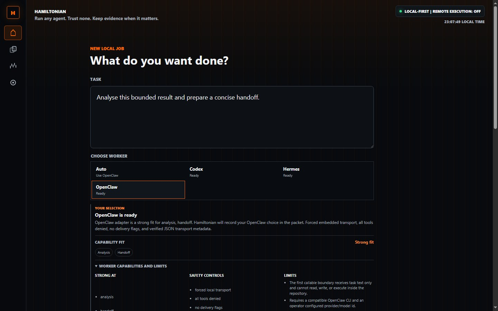

Every terminal supervised run writes `result-receipt.json` with adapter, lane,
status, timing, task digest, result digest, and result length. The receipt never
contains the final answer. A Codex/Hermes comparison requires successful
receipts for two different packets with the same task digest. Opening the
preview launches nothing; the second run requires a separate explicit action.
Saved comparisons store only receipt metadata and the operator decision. When a
comparison is reopened, Hamiltonian reads each original answer only from its
packet runner directory and verifies its SHA-256 digest before displaying it.
Choosing a result and creating a goal does not call either agent again.

If Codex, Hermes, or OpenClaw is not callable, its plan remains visible but
launch stays disabled with the probe failure shown in the cockpit. The direct
local lane still stops at the dry-run adapter contract. Runner-plan artifacts
contain a task digest and workspace name, not task text or the workspace path.
Blocked packets do not write a runner artifact.
Handoff-stage packets add a compact operator brief with lane, route, gate,
approval, and evidence state in one place.

Packets can also advance in place. Advancement preserves the packet id and
packet directory, reruns the local gates for the target stage, updates the
packet index, and appends a local history event without executing agents.

The packet stages are:

- `draft`: save the operator task and selected agent lane.
- `gate`: check memory through the RepoMori adapter boundary, then run local intent and cost gates.
- `execute`: prepare an explicit approval boundary and, for a ready Codex, Hermes, or OpenClaw lane, optionally launch one bounded local CLI run.
- `handoff`: prepare a local operator handoff brief after gates and any launched run are complete.
- `record`: run the same gates and attach a local AgentLedger evidence placeholder.

The cockpit exposes recent packet summaries through `/api/packets`, full packet
detail through `/api/packets/<packet-id>`, and local runner lifecycle controls
through `/api/packets/<packet-id>/run` and
`/api/packets/<packet-id>/run/cancel`. Reads and writes stay inside the
repo-local task packet store.

Recent packet listings use `.hamiltonian/tasks/index.json` first and rebuild it
from packet files when the index is missing or invalid.

The same packet create, advance, list, index rebuild, detail, and sanitized
export surfaces are available from the CLI through `hamiltonian packets`.

Packet detail can export a sanitized handoff markdown file to:

```text
.hamiltonian/tasks/<packet-id>/handoff-export.md
```

The export omits repo paths, packet storage paths, artifact paths, file
contents, credentials, and remote URLs.

No remote command executor is used in this slice. Codex, Hermes, and OpenClaw
launches are locally supervised CLI processes; model access remains the
responsibility of the operator's existing CLI configuration. Missing OpenClaw,
Hermes, RepoMori, Jester, Tokometer, and AgentLedger integrations degrade to
explicit local fallback states.

The RepoMori adapter is privacy-preserving in this slice: it writes sanitized
metadata only, with no file contents, private path names, credentials, URLs, or
remote calls. If RepoMori is installed, Hamiltonian marks the adapter boundary as
ready but still does not execute the external tool yet.

The rendered cockpit journey can be replayed in a clean temporary D-drive
workspace with the dependency-free browser smoke check:

```powershell
node scripts\cockpit_browser_smoke.mjs
```

It drives the one-button Home flow through successful completion and
cancellation, checks that only four primary navigation choices are visible, and
verifies unavailable guidance, Auto/Codex/Hermes/OpenClaw selection, comparison consent,
side-by-side receipts, comparison history, operator decisions, sanitized export,
chosen-result goal lineage, capability fit and refusal, optional recorder evidence, and a Hermes one-shot packet
and tool-less OpenClaw embedded packet through Mission Home in a real local Edge session. The smoke journey supplies deterministic local fakes for
the Codex, Hermes, and OpenClaw commands, so it uses no model credits or credentials. QA
packets are removed after the run. The
sanitized Mission Home, completed check, goal review, corrective lineage,
launcher, and mobile captures are written under
`D:\Hamiltonian\Temp` by default.

The lower-level `run` command still writes:

```text
.hamiltonian/runs/<timestamp>/
  hamiltonian-report.md
  hamiltonian-report.json
  manifest.json
  artifacts/
    command.stdout.txt
    command.stderr.txt
    git-status-before.txt
    git-status-after.txt
    git-diff-after.patch
```

## Optional Integrations

The prototype detects these tools if already installed:

- AgentLedger: evidence bundles for agent work sessions.
- RepoMori: compact repo memory.
- Memento Mori Jester: plan, command, diff, and final-answer safety checks.
- Tokometer: local Codex token burn posture.
- TokenSquash: measurable prompt/reply compression.
- Sentinel Manifold: release-gate / behavior-regression proof layer.
- Hermes Agent: optional local one-shot agent lane using existing provider configuration.
- OpenClaw: optional tool-less embedded analysis and handoff lane using an operator-configured model.

Missing tools are reported as warnings, not failures. That lets the wrapper work
today while the full product stack is assembled.

## Market Wedge

OpenClaw and Hermes compete to be the agent. Hamiltonian owns the layer above
the agent:

```text
Run any agent. Trust none. Keep evidence.
```

The cockpit now offers Hermes as a bounded agent lane and OpenClaw as an even
narrower tool-less embedded lane. The market is not
"which agent is coolest"; the market is who operators trust to route, gate,
verify, and prove agent work across all of them.

## Licence And Commercial Use

Hamiltonian is public source-available software under the
[PolyForm Noncommercial License 1.0.0](LICENSE). Non-commercial personal,
research, educational, hobby, and public-interest use is permitted. Commercial
products, paid services, managed platforms, enterprise tools, commercial AI
systems, and resale require a separate written licence from TWO HANDS NETWORK
LTD. See [NOTICE.md](NOTICE.md) for the plain-language boundary and
[CONTRIBUTING.md](CONTRIBUTING.md) before submitting material.
